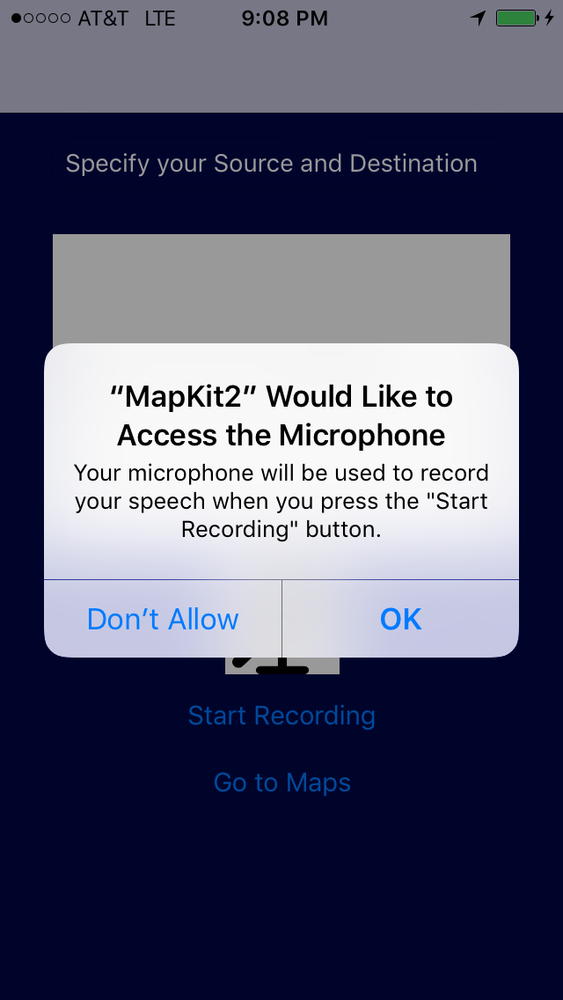
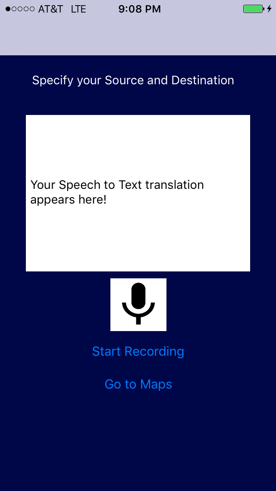
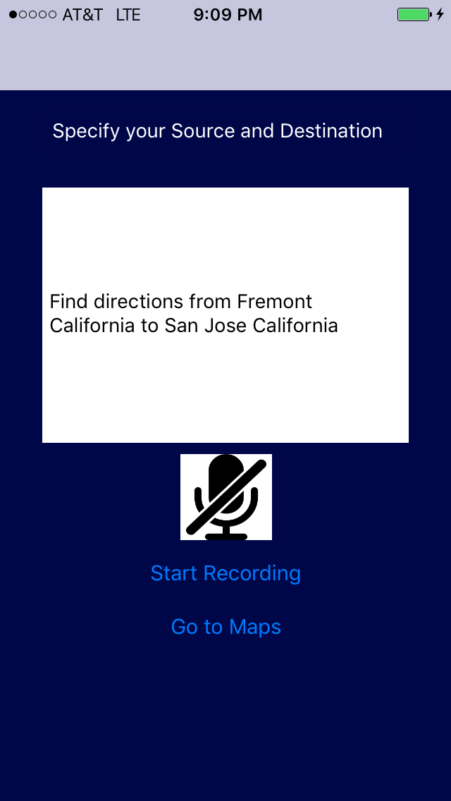
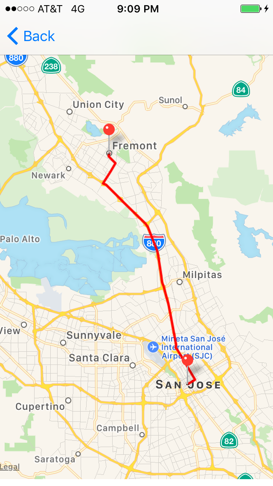
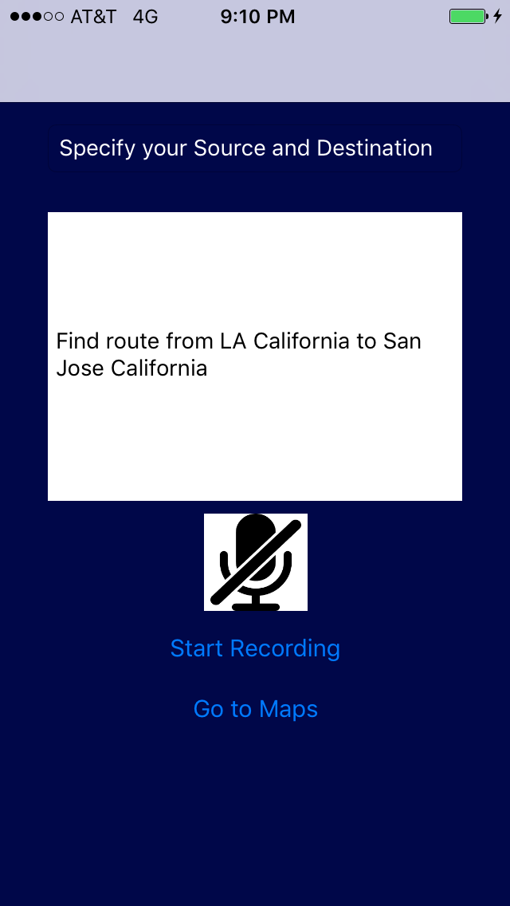
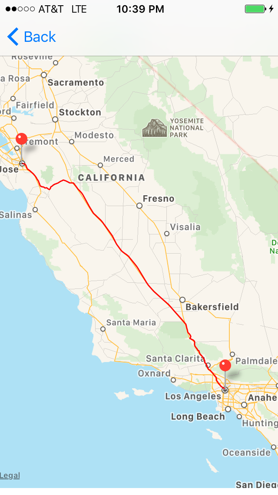
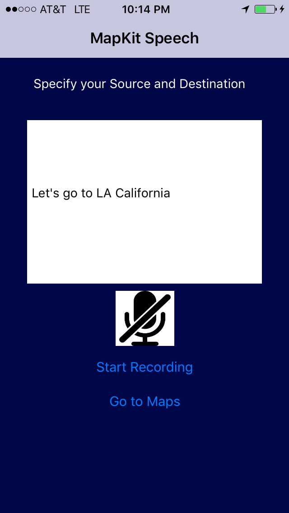
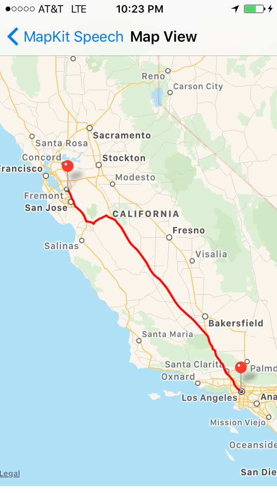

# Mapkit-with-Speech-recognition
It is an iOS Application that provides directions between two places on a map. The application chooses to show direction between 2 places mentioned or from current location to destination based on the speech input of the user. The application is designed to recognize the user's intention from the speech and provides directions accordingly. I have made use of MapKit and Speech recognition in this application. All of the users searches are stored in a flat file for enhancing speech recognition. 

### 1.	App permission
Provide the following permissions to let the app access your voice input.

### 2.	Speech to Text Screen
Select the mic button and say what you would like to see in the map in the following format.

#### FROM words
***["from", "directions from","direction from","direction between", "route between"]***
If the User's speech string contains any of the above words, then the application picks up the word adjacent to it as the from address location. If words from the above array are not found, then the application picks up the current location as the source address. 

####TO words
***["go to","goto", "route to"]***
When the user's speech string contains any of the following words, it finds the word adjacent to it as destination address. If this is missing then the user is prompted to reenter speech.

The text is parsed where the program looks for the keyword to and finds the text following in it and takes the current location as source location.

### 3.	Find direction
Say ***“Find directions from Fremont California to San Jose California”***. The location information is displayed in a mapview.

     
### 4.	Find route
Say ***“Find route from LA California to San Jose California”***

    
### 5.	Let’s Go
Say ***“Let’s go to San Jose State University”***. In this case the user’s current location is picked and used as the source location. This requires the user to grant the app permission to access the user’s current location.

Say ***“Let’s go to LA California”***

### 6.	Searches stored in Flat File
All the searches are stored in a flat file for future references

 

